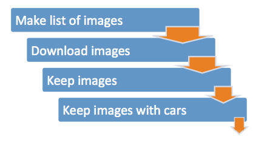
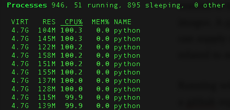
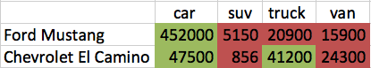

# 850k Images in 24 hours: Automating Deep Learning Dataset Creation

## The why
Normally this computer vision adventure would start with the protagonist scouring the internet to find dataset owners. These individuals have already gone through the trouble of amassing a large number of images, looked at each image, applied labels and/or tags for each image. This individual would have packaged things up for their own purposes and probably had the labeling work performed by indentured graduate students.
If you are lucky some small percentage of each corpus located relates to the feature/item that you yourself are attempting to amass.
Wash, rinse, repeat until you have amassed a corpus large enough to satisfy your personal data lust.
I would like to bypass corpus searching, downloading, and triage by automagically making my own labeled data. I want to make a dataset and only spot check a small number of images.
I am building a classifier and need a healthy number of images in a short amount of time. The classifier will be used in an upcoming project named Pelops. The classifier will take an image and determine the body type of a vehicle i.e. subcompact, compact, car, van, SUV, crossover, etc.

## Thoughts before actions
I initially started thinking of sites with published APIs to call, like Edmonds, where you can specify the make and model of a vehicle. This approach would allow me to get images by make/model and I could use another site to ask for images by body type.
Secondly I thought of hierarchical sites similar to Craigslist, where I could grab images and mine the posting for make and model. (Mining the posting was something I was not looking forward to.)
It became apparent that I would need to work across several sites to get the number of images I wanted. Each site would need an interface to the API or customized scraping code to bring in the images.
It was getting close to coding time; I needed to channel my inner lazy developer and think of ways of getting images on my terms. I definitely wanted to hand a list of attributes to something and have it return a series of images. A colleague and I thought that this is perfect occasion to abuse a search engine. I can supply color, make, and model; the search engine would mostly return images related to my query.

## The pipeline
  
Running with this idea I found an article of the top 10 car colors, along with a GitHub repo where I could quickly extract around 1000 makes and models of vehicles.

### Make list of images
Writing code to query/scrape a search engine then download images from a search engine took less than a half hour. Running the script, creating the list of images to download took 5 hours (search engines get persnickety if scraped too quickly).
(100 images * 1046 make/models * 10 colors ) would mean I would hopefully amass around a million images. Whether they would be useful images was something for future me to worry about.

### Download images
The actual image downloading took over 10 hours. Some sites were unresponsive or slow to download.
[NOTE: Some of the material you download may be copyrighted]

### Keep Images
Even though I asked for images, sometimes you don’t always get what you want. I was not performing file type checking at download time. Spot checking showed I was sometimes downloading HTML instead of the image. The number of non-images was small compared to the number of images, though.
I needed a program to detect if a file was indeed an image or not. The program was pretty speedy and cut through the million plus images in around 7 minutes.

  
it’s A Bird… It’s A Plane… It’s python multiprocessing to the rescue

### Keep images with cars
Removing the not-images led to the next issue; some of the downloaded files were not images of cars. Not wanting to personally Mechanical Turk over 950k images, I turned to using a pre-trained computer vision model to help me out.
I made use of Keras and a pre-trained neural network (resnet50) to determine if a car was in the image. If one of the following terms [‘car’, ‘truck’, ‘suv’, ‘ambulance’, …] was in the top 4 labels returned for the image I kept the image.
Running the images through a GPU assisted deep learning model took around 8 hours. The model evaluated approximately 2000 images/minute on a single Titan X.
After the final pass, about 840k images were remaining. A cursory look through the data showed mostly cars.

### Create additional textual features
My final lazy idea for supplementing image labels comes via even more search engine abuse. I wanted labels of car, SUV, truck and/or van for each vehicle. To see if a specific make model of a vehicle should have the label, simply search for it and count the results.
Attempting to classify the Ford Mustang I would perform 4 searches:
1. “Ford Mustang car”
1. “Ford Mustang suv”
1. “Ford Mustang truck”
1. “Ford Mustang van”  

I would then capture the number of results returned by the search engine.  

  
Vehicles and results for proposed body style labels 9Dec2016  

You could take the largest value as the label, or use the array as vector to describe the class. I bet the vector would be better because of cars like the Chevrolet El Camino.

## Closing Thoughts
* None of the pipeline stages need to be perfect.
* Each successive stage of the pipeline should improve result quality.
* More computationally expensive stages should be placed later in the pipeline if possible.
* Small numbers of non image of interest within the corpus is ok
* Utilizing multiple search engines improves dataset creation
* Not an end but a journey; use what what downloaded to make a better classifier and repeat.

Total time for creating the scripts, downloading and processing the files took just shy of 24 hours.  

I now have a reasonably sizable labeled dataset containing the features I specified created with minimal human intervention.  

If you are interested in generating your own dataset checkout the git repo [https://github.com/d-grossman/scrapeCars]  and watch Pelops [https://github.com/Lab41/pelops] for how the lab will be using the car data.  

dgrossman
