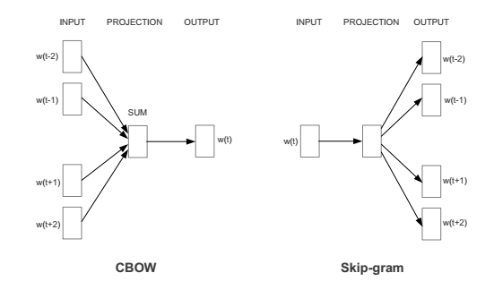
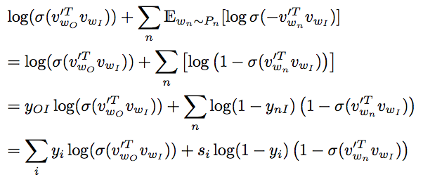
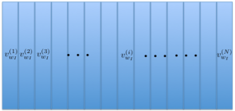
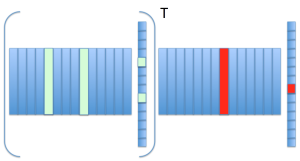
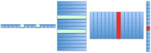

## 2Vec or Not2Vec?
This might be old news to you, but if you’re considering the use of word embeddings, our suggestion: just take the plunge. We’ve read a “few” studies documenting their effectiveness, not the least of which is our personal favorite:

`
This paper is summarized best by its own statement, which should win it the award for most honest paper ever:  ...we set out to conduct this study because we were annoyed by the triumphalist overtones often surrounding [neural network embeddings], despite the almost complete lack of a proper comparison…. Our secret wish was to discover that it is all hype… Instead, we found that the [embeddings] are so good that, while the triumphalist overtones still sound excessive, there are very good reasons to switch to the new architecture.
`

[Baroni, Dinu, and Kruszewski](images/baroni.pdf) are a bit dramatic, but they get the point across. You may not be able to explain why (though we’ll try, here), but embeddings sure done work good. And as the most popular word embedding algorithm, not many techniques have caught fire as much as Tomas Mikolov’s word2vec algorithm.

In 2013, [word2vec](http://arxiv.org/pdf/1310.4546.pdf) made waves in the neural network world. The code was readable and really fast (multi-threaded C code), helping it achieve wide adoption. Since then, Google archived the code (though it’s still available), and Mikolov changed companies. Still, that didn’t stop the momentum, and there’s been a glut of implementations on platforms and software packages like Python, Scala (and [ML-Lib](https://spark.apache.org/docs/latest/mllib-feature-extraction.html#word2vec) in Spark), [DL4J](http://deeplearning4j.org/word2vec.html), [gensim](), and [maybe a zillion more](http://lmgtfy.com/?q=word2vec+implementation), to make it fit into the everyday man’s NLP toolbox.

In fact, word2vec has been applied to not-so-obvious applications: twitter network analysis, network traffic analytics, named entity association, and the list goes on. But the 2Vec craze doesn’t end with word embeddings. If you’ve been to CVPR 2015 or participated in Baylearn 2015, you’d know that Yann LeCun is bent on embedding the world, i.e. “World2Vec” (make sure Google doesn’t autocorrect you when you search for it.) The World2Vec pitch in the linked video starts at 50:24, but the LeCunian entertainment is present throughout the video.

LeCun’s brand of enthusiasm might make you doubt the extravagant mantra (that vector space can, but that’s not just crazy talk, since Hinton’s group has similar ideas. And yes, we take it literally when we say ideas: the group (Ryan Kiros, primarily) has, in fact, implemented a type of “idea-2-vec” in recent Q&A work, which is open on Git. They call it Skip-Thought Vectors, which is synonymously known as sent2vec. Our personal favorite from “awesome deep vision” is where Baidu’s chatbot claims to be able to fool you into thinking you’re talking to a human.

As an aside, we’re “meh” on this. Claims regarding chatbots being Turing Complete have always been suspect. That’s a whole other blog post (which we’ll write later, time permitting, but Google for NPR’s Fresh Air’s take on it.) It really depends on the situation. For example, a statue could pass the Turing test…if a dog administered it:

Sorry, we’re getting carried away. Anyway, so why this blog post? Why not read the papers? After talking with several colleagues and friends spanning multiple countries, as it turns out, not a lot of people know why it works and why it’s called a neural network. They had a good grasp of what was happening, but formalizing it in deep learning frameworks was difficult and the papers weren’t helping.

Really, the concepts as explained are surprisingly simple. But, if you’re like us, who jumped on the DL-train to Bandwagon-Town, we like writing Keras/Theano/Torch/Caffe layers to fit into existing and new architectures. And although the DL-train is full-steam ahead and doesn’t often stop for explanations, we feel like this one deserves a deeper look.

## What We're Familiar With

There are a lot of DL packages out there, and nearly all of them have a good suite of objective/cost functions. For the uninitiated, objective/cost functions are those equations you’re trying to minimize, and they usually follow some logical principle like, make the error between what we predict and the truth as small as possible. Look at the Keras toolbox’s “Available Objectives” for the most commonly used ones, you’ll see:

If you’ve been involved in the ImageNet competition, you probably love categorical cross-entropy so much you want to marry it. In this blog post, we’re going to step away from that function. Why? Because chances are, you’re using a softmax layer before optimizing, normalizing the output to a posterior probability. That’s nice, but only where you know your input relates to exactly one of the classes in the set of candidates. In the case of text prediction and vector space construction (the key idea of word2vec), where a predicted value should relate to multiple labels, we prefer binary crossentropy (and heck, even, MSE). That optimization (according to Hinton) is written as:

$$\sum_i y_i \cdot \log( h(x_i)) + (1-y_i) \cdot \log(1 - h(x_i)) $$

Here, the y’s are the true outputs and h(x) is the output of the neural network that you’re building. We’ll try not to get too math-y, and at this point in time, you’re probably asking, what’s our point? Well, not a lot of people know that word2vec is precisely a 2-layer conventional neural network with a slightly modified binary cross-entropy optimization. If you can visualize that, there’s no need to read further. Otherwise, we’re going to show you that you can make word2vec out of all the traditional objective function parts and layers from your toolboxes with some slight modifications.

## The Rub

Chances are, if you’ve read anything about word2vec, you’ve seen something that looks like this:

This is great for explaining out word2vec works (look up anything written by Chris Manning). Unfortunately, these diagrams, IMHO, do us a disservice because they obscure how they relate to conventional neural networks. Also unfortunate is that the people call this “deep learning”, because doing so, again IMHO, makes the term lose some of its original meaning. I’d call vector spaces learning wide learning rather than deep learning.

Mikolov’s Word2Vec runs on something called negative sampling, a generalization of Noise Contrastive Estimation (NCE). It’s a math-y paper, but worth the read if you’ve got the time and patience. One thing that’s glossed over is that NCE can approximate the minimization of the log probability of the softmax. As it turns out, instead, negative sampling approximates the binary cross-entropy cost function (the log loss for some of you).

Negative sampling can be expressed by the below equation (taken directly from Mikolov’s paper):

$$ \log( \sigma( v_{w_O}^T v_{w_I} ) + \sum_n \mathbb{E}_{w_n\simP_n} \left[ \log \sigma( -v_{w_n}^T v_{w_i} ) \right] $$

Here, $$v_{w_O}$$ is the output word vector (relating to $$w_O$$), $$v_{w_I}$$ is the input vector (relating to $$w_I$$), and we are drawing word wn from the negative distribution of words: Pn(w). We’re summing over only a select number of negative examples (i.e., n goes from 1 to a small number…let’s say 10). To build some intuition, it might be straightforward to see how maximizing this function produces the vectors that you want (in both input and output spaces).

- The first term: maximize the inner product of your input vector and an output vector.
- The second term: simultaneously minimize the inner product of your input vector and a bunch of randomly sampled vectors.

Easy, right? No? It’s a bunch of fancy letters just to say that you’re pushing words close to their context and pulling them away from the background distribution. Assuming that we are already taking samples from the background distribution (i.e., getting rid of the expectation notation), we can just sum the correlation of a randomly sampled vector with the input vector. If we say that y is an indicator as to whether or not a word is in the context of another word (1 = in context, 0 = not in context), then the value for y (let’s call it yOI) relating to the output (denoted by subscript O) and input vector (denoted by subscript I) is equal to one. Likewise, the value for ynI relating to a negative sample (denoted by subscript n) and the input vector (again denoted by I) is zero. Then, after some derivations, the cost function looks suspiciously familiar:

Pay attention to that last line; not only did we introduce the binary y vector, but we’ve also introduced this si value, which stands for sample i. It’s one or zero depending on if you’re actually using this sample. That is, if your negative sample includes the label category i.

So look at this last line and look at the binary cross-entropy function equation in the previous section. The only difference between the word2vec cost function and binary cross-entropy is that you’re doing negative sampling: the si, which effectively chooses a subset of the samples when y=0. That’s what that si term is in there for. It’s really just saying, I don’t want to take every word vector that’s not related to my input word vector into account…that would be too expensive. No, let’s just take the one that’s the most relevant.

## Redistributing Distributed Learning

That’s the cost function, now the architecture. Let’s say that we have a vocabulary, and instead of drawing the vectors individually, let’s draw them all together. We can collect a whole bunch of vectors of words and assemble them into a matrix. Let’s call this matrix VI.

(Imagine that each column is a word vector. In this case they are all the input word vectors.)

On the flip side, you remember the “one-hot” encoding vector idea? If the ith word in the dictionary is being used, then the ith element of a one hot vector xI is nonzero:

Let’s say we’re looking at the ith word. Then, that means we want to optimize for the ith vector. To extract that vector from the matrix Vi from in a linear algebraic sense, it’s simply a matrix multiplication: vwI=VI xI. If you need a picture, take a gander at this:

Recall the objective function, where we’re multiplying the vector input with multiple output vectors. Let’s say, for example, I want to multiply two output vectors with the input vectors. So similarly, let’s select the output vectors, and multiply. Visually, this looks like:

which is the same as:

Let’s turn the diagram 90 degrees, and put a cherry on the top by adding a sigmoid nonlinearity function.

So, if I were taking the sum of all the outputs, this would just look like:

$$ \sum_i \log( \sigma( v_{w_i}^T v_{w_I}) ) = \sum_i y_i \log(V_O V_I \textbf{x} $$

This should be more what you’re used to, though if you implement it like this with traditional tools, it’s probably really inefficient since you’re using matrix-vector multiplications rather than Mikolov’s vector-vector multiplications. Depending on how many vectors you use for negative sampling, you really only need to update a few vectors every iteration. So, obviously, you won’t want to use the BLAS library on the entire matrix vector multiplication, but if you plug in our equation from the previous section in, you’ll see that this is exactly your run of the mill neural network implementation, just tons more efficient.

As a whole, current implementations (especially the multi-threaded) are cool because you’re sampling on the foreground and background distribution, and so in the limit, you’ll converge to a solution that places vectors based on their co-occurrence in text. There’s also a random component to it that could potentially get you out of local minima, given enough iterations. We’re real fans.

## What did we just say?

There you have it. The word2vec architecture is a neural network with two parameter matrices followed by a sigmoid activation function. It’s optimized by a binary cross-entropy cost function, using random negative sampling. If you want some code, feel free to get it at our Lab41 Github page.

