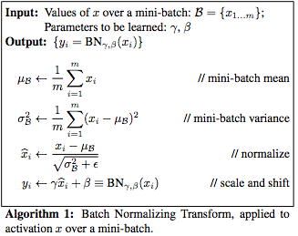
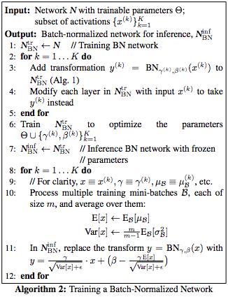
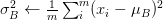
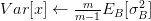
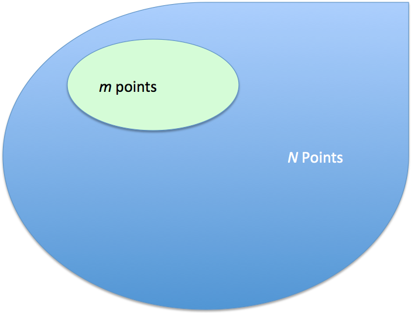
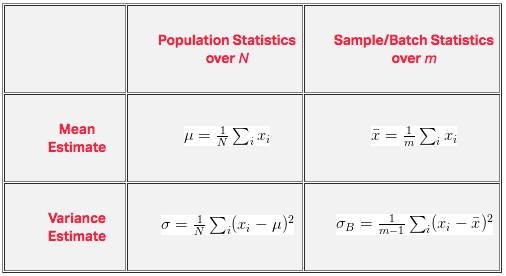
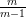

# Batch Normalization - What the Hey?

A little while ago, you might have read about batch normalization being the next coolest thing since ReLu’s. Things have since moved on, but it’s worth mentioning because it has been adopted in most networks today. The original paper is pretty dense, and it’s all goodies inside of there. So, this blog post is devoted to explaining the more confusing portions of batch normalization. What follows are a few concepts that you may find interesting or may not have fully understood when reading over Ioffe and Szegedy’s paper. We hope that it’s helpful.

## Covariate Shift

Just in the first page, Szegedy delivers a quick shot to your ego with vocabulary like covariate shift and domain adaptation. I had to dust off a few books and go through a few Wiki pages, but what I gathered is as follows. (BTW, I’d recommend reading Alex Smola’s post, using logistic regression to address the issues.)

Formally, covariate shift is defined as a change in the distribution of a function’s domain. Informally, it’s when your inputs change on you, and your algorithm can’t deal with it.
For example, let’s say I’m hungry while I’m working. Everyday, Jane brings in Mac ‘n Cheese Hamburgers and Carrot Burgers. Also let’s say that Carrot Burgers look somewhat like Mac ‘n Cheese Burgers. Ted has never been exposed to Mac ‘n Cheese Hamburgers, so yesterday, I took him into the breakroom and point them out by describing them so that he can attempt to learn a function Ps(Y | X), the probability of Y being a Mac ‘n Cheese Burger given the features X. Here X are my descriptions like color, smell, etc. Essentially, I’ve trained Ted on a set of burgers S = { (X0, Y0), (X1, Y1), … } to recognize which Y burger to get, based on what Mac ‘n Cheese burgers look like, X.

Today, I’m busy, so I ask Ted to go get me a M&C burger. Since he knows what P (Y | X) is (or at least he thinks he does), I’m confident that although I know carrots are good for me, I won’t be eating them for lunch. Trouble is, Jane went to a different store today to pick up Mac ‘n Cheese & Carrot Burgers. Let’s call this set of burgers T, and the burgers in T look different than the original set of burgers S. Naturally Ted’s confused, even though he knows P (Y | X) = Ps(Y | X) = PT(Y | X). Why is he confused? Because Ps(X) ≠ PT(X): the source distribution is different than the target distribution. The ketchup is darker, the buns are lighter, and so on. In short, the feature space of T is drastically different than S, which was what was used in training.

Why does this matter? A great little explanation is here, but the general idea is that we’re not actually learning P(Y | X), but rather, the model of $P(Y | X, \theta)$, where θ are the parameters of that model. And since often times it’s difficult to specify the right model for a phenomenon (for deep learning, we’re pretty sure it’s never the right model), the distribution of the input, i.e. P(X), is important. To correct for the shift, a fix could be to re-train with points in S by weighting by $$P_T(X) / P_s(X)$$, or the perceived true distribution. This is called importance sampling, which we won’t talk about today.

## Internal Covariate Shift

Within a single training set, covariate shift isn’t that big of a deal for most machine learning algorithms. After all, even if you’re taking subsets/mini-batches, the statistics from batch to batch don’t change very much, provided you’ve randomized access to the dataset. But deep learning, by its very nature, is parameterized in a hierarchical fashion, and therein lies the problem.

At the first layer, you’re typically looking at data from a source S, and statistics from each batch remains somewhat similar during training. The problem is, you’ve got a lot of layers, a gabazillion if you’re Microsoft, 152 to be more precise. Since the output of the first layer feeds the second layer, the second feeds the third, and so on, this is problematic.

Why? Have you ever played the game telephone with cups and strings? Think of this as that, only you can tweak your phone to make it clearer (i.e., tune your parameters). The first guy tells the second guy, “go water the plants”, the second guy tells the third guy, “got water in your pants”, and so on until the last guy hears, “kite bang eat face monkey” or something totally wrong. Let’s say that the problems are entirely systemic and due entirely to faulty red cups. Then, the situation is analogouts to forward propagation.

Now, let’s say we can fix our cups (or get new ones) so that we pass messages better. We tell the last guy the right answer, and he fixes his cup a little bit, and then tests it out by talking to the second-to-last guy through it. The second-to-last guy tells the third-to-last guy to fix something, and all the way back to the first guy. Backpropagation, right?

The trouble is, everybody’s fixing stuff at the same time. So, when one guy tells the next guy stuff, he’s doing it with his new cup, i.e., parameters. And that’s bad because everyone is getting a new phone/cup based on what the guy after him told him…only the message changes because the cups change. To put it another way: your first layer parameters change and so the distribution of the input to your second layer changes. By changing around parameters, you’re intentionally causing something that Szegedy calls “internal covariate shift”. Usually, it’s not a problem with only a few layers; it gets pretty hairy when you’ve got a truly deep neural network.

## Training versus Inferencing

To remedy internal covariate shift, the solution proposed in the paper is to normalize each batch by both mean and variance. The details are in the below couple of figures.

You might notice a discrepancy in the text between training the network versus testing on it. If you haven’t noticed that, take a look at how sigma is found on the top chart (Algorithm 1) and what’s being processed on the bottom (Algorithm 2, step 10). Step 10 on the right is because Ioffe & Szegedy bring up unbiased variance estimate. During training, you’re normalizing by

the variances. Then, when you’re testing, you’re normalizing by something called the unbiased variance estimate which is calculated like this:

What gives? Why can’t you just set Var[x] to be equal to E[σ²]? Where did that m/(m-1) come from?

Actually, you haven’t realized it, but in performing the procedure in Algorithm 1, you’re not really taking population statistics. That’s something we should clarify right now. You are, in fact, taking the batch statistics. Estimating the true mean and variance is calculated over the entire population (see the figure below), but when you’re minibatching your way through the entire dataset, you’re calculating statistics on a per sample/batch basis. And those are different concepts, so sample statistics need to be calculated differently in order to make them equal in expectation to the population statistics. Rather, we want our sample statistics to be unbiased to population statistics.

How would we reconcile the differences? First, let’s take a look at the unbiased estimates of both mean and variances in the following table:

The difference between the variance of the population versus the sample/batch variance is that σ is normalized by m and s is normalized by (m-1). Conceptually, the reason why we use (m-1) is that you’re also estimating the mean (in the form of x bar) to be centered, you’ll have to expect that the spread of your points (i.e., variance) will be a bit larger. In this case, it’s going to be precisely m/(m-1) larger. So, when we assign

under Algorithm 1, you’re underestimating the true variance of the dataset, which is why Algorithm 2, line 10 requires an additional term:

You should work out how we got these for yourself. It’s probably been an interview question at one point in time or another, but it will also give you a pretty good understanding about how and why mini-batching works.

## What the hey? Or that a way!

And that’s how we normalize our batches. In general, the paper is a step by step procedural paper that tells you how to implement a “BN” layer. It’s still worthwhile to understand the underlying reasons for their design choices so that you can make your own decisions in your networks. Hopefully a lot of those decisions were elucidated in this article. We’ll let you try to see why or how this work better by coding it yourself (or available through the various frameworks), since that’s how we learned.

