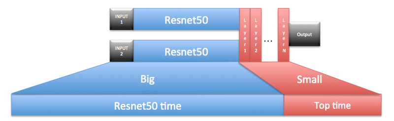

# Iterating through Siamese network designs

## I see Siamese networks.
TL;DR — first, iterate quickly with a time memory trade off, then rank architecture performance, finally refine by rank order.  

I recently finished evaluating several Siamese network architectures, and wanted to share a method I found useful in reducing model training time. The task was to determine similarity between portions of an image extracted from video. Simplistic comparison methods failed and I needed to move to evaluating several large networks. Time became an issue.  

## Background
A Siamese neural network is a neural network that contains two or more identical subnetworks. This means the subnetworks start with the same initial conditions (configuration, parameters, and weights), and training maintains weight symmetry.

  

Siamese networks are often useful in creating a similarity measure between the inputs. Siamese networks are used to determine if images, text or audio contain similar content.

  

## The now
My current problem requires a good similarity measure between images for later processing.
I started by removing the classification layer of a Resnet50 network. I then ran images through the network and examined the cosine distance between the processed vectors. I then tried using a Support Vector Machine (SVM) to compare the image vectors. Neither method was performing well for my image dataset.
I moved to Siamese networks for performing the comparison. I had many ideas for topologies and wanted to try them all.
My first Siamese network was built from Resnet50 with the classification layer removed. I added a vector subtraction layer to combine the two Resnet50 outputs, a fully connected layer, and finally a classification layer.

  

## Initial training and testing
The team created a function to make experiments. The function returns two images from a set of labeled images and similarity truth between the images. The images and the expected similarity are then used to train the network.
I generated many experiments and fed the experiments in batches through the above model in two phases:

1. Freeze Resnet50 features, only allowing updates to occur within the top of the Siamese network.

  

2. Free Resnet50 features and perform end-to-end model training.

  

The problem with this method was iteration time. Getting a model trained to the accuracy I wanted would take about 2 days. I had too many Siamese topologies to explore and little patience waiting for results. I needed to rank my architectures and only refine models providing the best results.

## Back of napkin musings
  

In terms of improving model training iteration time, a few thoughts come to mind:  

1. End-to-end training a pipeline is better than independently training models then pipelining them together. End-to-end training allows for a global optimization that is not possible when training models separately. However, you don’t need to start with end-to-end training, only finish with it. (This is something I observed in my two-phased approach to model training.)
1. End-to-end training slightly increases model accuracy.
1. Evaluating Resnet50 networks eats up most of my processing time.
1. My process has two parts: one where Resnet50 was a constant and another where I was refining the architecture end-to-end.
1. Using these four thoughts I could improve my model training iteration time.

## Time memory tradeoffs
Most of my processing time was spent evaluating Resnet50. To get around paying the Resnet50 tax (twice) I decided to pre-process all my images through Resnet50 and create an image-to-features lookup table.

  
Image-to-features lookup table  

Then I used the lookup table to feed the top of the Siamese network; instead of calculating the features.

  

I amortized my Resnet50 evaluation costs over all the potential models I wanted to explore. Pre-processing my image set took half a day. The payoff came when I worked through 10 different architectures for the top of the Siamese network in a day.
It still took about a day to do the final refinement (performing end-to-end training) as lookups could not be used there.

## Takeaways
* Take a look at your processing chain. You may be able to steal a technique from dynamic programming to make things better. In this case I made a lookup that was re-used across several models.
* Overfitting needs special consideration. When making the training dataset it may be necessary to augment the data; it is easy for a network to memorize a dataset. Augmentation comes with a cost as a single input example can easily yield upwards of 30 augmented outputs (shift, flip, zoom, clip, rotate, etc.). Find your balance of speed vs. storage.
* Architecture rankings may change after end-to-end training. Well-trained architectures appeared to receive about the same amount of boost from the end-to-end training. I ranked models by validation accuracy. I would then end-to-end train the model with the highest validation score. The validation-sorted listing made sure I always spent my resources on the architecture that maximized success.

dgrossman
