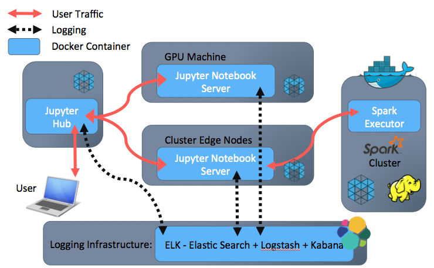

Docker allows you to describe a consistent, reproducible container for your executable. The container provides lightweight isolation of the application from the underlying operating system and hardware. This isolation allows full filesystem control — runtime, system libraries, and executables can all be specified.  

# Moving forward with better Docker integration
The results we analyze depend on code, data, and the production environment. Hashes can easily determine if the code or the data is different, but determining if runtime environments are different is more involved.

Differences between analyst work environments caused result discrepancies and code execution errors. Programs “worked” for some but not all the analysts. The solution was to use Docker to explicitly describe dependencies, creating a consistent development environment (write once run anywhere).  

This means that changes in the environment migrate to every machine we use, preventing problems when other people in the Lab need to use someone’s code. Running Dockerized analysis also has the benefit of making project hand-off to people outside the Lab easier. Analysts do not need to worry about environmental differences causing execution failure, or even worse, differing results.  

  
Current Lab Data Science Architecture  

Our data science platform uses Docker containers at three different junctures in our workflow. There is a front end providing access to JupyterHub, the middle tier provides access to a Jupyter notebook server and the back-end tier is used by Apache Spark’s executors.  

The front-end container hosting JupyterHub is responsible for authenticating and proxying users to the middle-tier containers.  

The middle tier provides containerized Jupyter notebook servers. The containers are scheduled by Mesos on machines with GPUs for performing deep learning, or on the Spark cluster where they communicate with a Spark context. The Spark cluster has been configured to use containerized executors. The containerized executors provide a cluster-wide uniform development environment. 


## Docker is increasingly part of an ecosystem
Docker is more than just a daemon living on everyone’s computer. The Lab has built up a large stack of services to make Docker more useful in our office.

## Registry
A registry is an application that stores and distributes Docker images. Registries are very easy to set up. The most basic config, without worrying about authentication, is a Docker one-liner:

`docker run -d -p 5000:5000 registry:2`  

In our environment, we landed on a pretty simple docker-compose setup that uses HTTPS port 443 to expose the registry to the world:
```
version: '2'  
  services:  
    registry:  
      image: registry:2  
      ports:  
        - "443:5000"  
      volumes:  
        - ./config.yml:/etc/docker/registry/config.yml:ro  
        - [path to layers on disk]:/var/lib/registry  
        - [path to SSL certificates]:/certs  
```

Surprisingly, we never found a graphical front end to the registry that we loved. The shipyard project only supports version 1 of the registry API, which has been deprecated for a long time, but we were able to pull in a proposed patch for v2 support.   

## Continuous Integration and Deployment
Docker images are appealing because there is a very reliable link between their human-readable definitions (Dockerfiles) and the images themselves. But if a Dockerfile changes in our codebase, we want to make sure that people pulling the corresponding image get the right version. We needed a way to propagate changes to an image as soon as their production-level Dockerfiles were changed.  

This is an obvious use case for continuous integration/continuous deployment solutions, since watching production codebases for changes is exactly what CI/CD does.  

We looked at roger, a project that purports to do exactly what we needed, but found its experimental UI a little too rough around the edges and wondered whether a more generic CI system might not be a good investment of time. We eventually settled on Drone, again using docker-compose and a custom dronerc configuration file mounted into the server container.  

```
drone:
  image: drone/drone:0.4
  container_name: drone
  volumes:
    - dronerc:/etc/drone/dronerc
    - [cert bundle]:[in-container cert bundle]:ro
    - [drone-related files on host]:/var/lib/drone
    - /var/run/docker.sock:/var/run/docker.sock # allow it to spawn containers
  env_file: dronerc
  restart: always
  ports:
    - "80:8000"
``` 

We like Drone for offering a reasonably mature, configurable CI server that doesn’t drown you in components of dubious utility. Our custom configuration is tiny — it just whitelists a few plugins and points the server at our internal VCS.  

Using a generic CI server like Drone also allowed us to contemplate taking a step that we have yet to implement: user-triggered custom image deployment. Part of our intended use of Docker images was to have the image offer a mirror of the user’s host environment — in particular, mapping their UID and primary GID in container to the host UID and GID. This allows traceback not just on events logged from a container but also on files created and modified in permanent storage by the container. We are experimenting with a system that modifies a templated Dockerfile in place before building it, with settings for the user environment and other functionality. It is a bit of a kludge, so we haven’t automated the deployment process yet.  

## GitHub
GitHub’s web-hook system is clean and very mature, so once the other services we set up were properly configured, triggering them using GitHub events like commits to master has been very easy.  

## Our Usage
The improvements made to the infrastructure normalized our compute resources. Analysts and customers alike have been utilizing the improved platform for over four months and successful demonstrated its value with our most recently completed challenges: Poseidon, Pythia, Attalos, and Gestalt.  

The lab is currently tightening up the infrastructure and readying it for public release, so watch our GitHub!  

dgrossman
