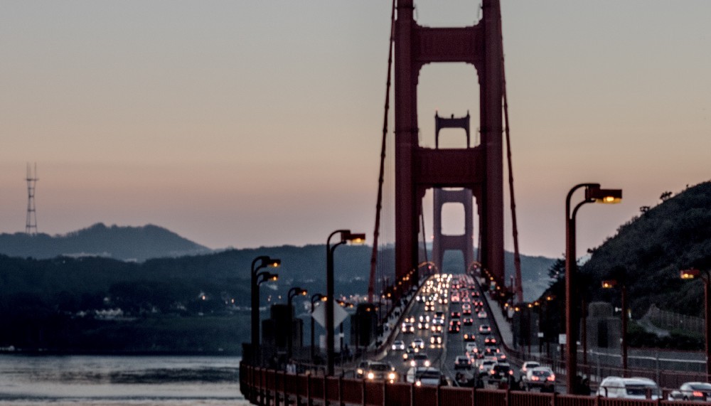
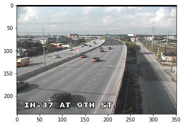
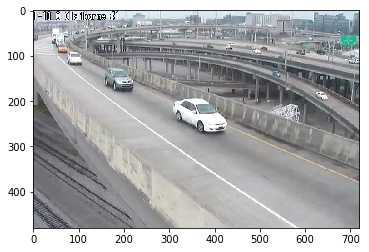
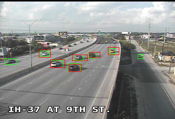
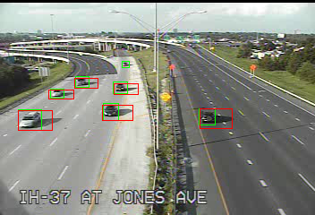
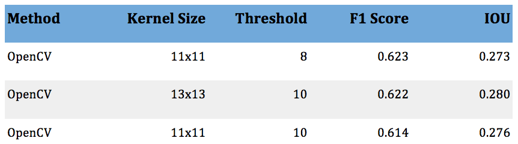
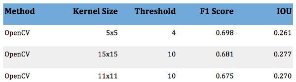
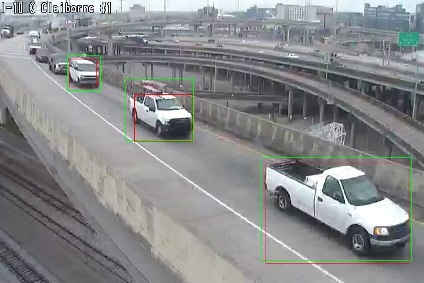
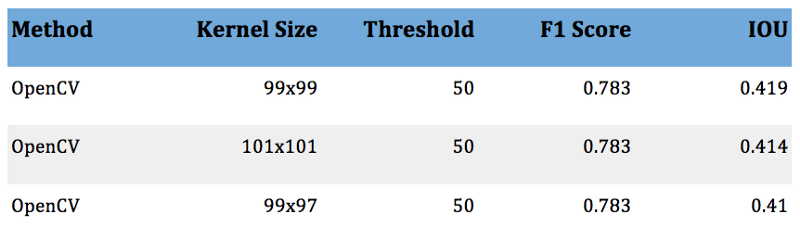

# Object Localization without Deep Learning

Lab41 is just wrapping up a vehicle re-identification project named [Pelops](https://github.com/Lab41/pelops). The goal was to be able to identify if the same car drove past a fixed set of video cameras without reading the license plate.

We broke the project down into three parts:

* **Chipping:** localizing vehicles within an image or frame from a video and extract and image (chip) containing the vehicle

* **Feature extraction:** producing a compact representation of a vehicle’s chip suitable for machine learning

* **Matching:** grouping chips of the same vehicle based on their feature representations

Today I’ll show you our approach to chipping; feature extraction and matching will follow in a later post.

## Chipping
There has been a lot of work done on using deep learning for object localization in the past few years. Deep learning based methods currently achieves state of the art results for many localization problems. In fact, our sister lab, [CosmiQ Works](https://medium.com/the-downlinq), explored using these techniques, and even developed a modified version of YOLO called [You Only Look Twice](https://medium.com/the-downlinq/you-only-look-twice-multi-scale-object-detection-in-satellite-imagery-with-convolutional-neural-38dad1cf7571) (YOLT) to do ship and plane localization in satellite images.

Deep learning seems like the best option for finding cars as well! But we don’t use deep learning, for two reasons:

1. An “off-the-shelf” network, [SSD](https://arxiv.org/abs/1512.02325), performed poorly.
1. We did not have much labeled data, so retraining wasn’t an option.

We were able to hand label about 200 frames of the traffic camera data in order to test our algorithms, but did not have enough time (or, critically, patience) to label enough vehicles to train or fine-tune a deep learning model. Therefore, we chose an old standard in computer vision: [background subtraction](https://en.wikipedia.org/wiki/Background_subtraction).

## Background Subtraction
What background subtraction tries to do, at its simplest, is to classify every pixel in an image as either background or foreground. Background pixels are ignored while foreground pixels are taken to be part of an object of interest. To do this classification the algorithms develop background models. We used two different algorithms with the only difference being the method in which they model the background pixels.

The first method used a very simple background model and was mainly intended as a benchmark. For each pixel it takes the median luminosity of the last ten frames. This gives a crude estimation of what objects are “permanent” and which are transient.

The second method was based on [a paper by Zivkovic and van der Heijden](http://www.zoranz.net/Publications/zivkovicPRL2006.pdf). It uses a Gaussian mixture model to estimate the distribution of background pixels in RGB space. It learns the distributions based on the previous frames and updates as new frames are processed. We used the implementation in OpenCV called MOG2, [cv::BackgroundSubtractorMOG2](https://docs.opencv.org/3.1.0/d7/d7b/classcv_1_1BackgroundSubtractorMOG2.html), which also includes a model for shadow rejection. Shadows are otherwise a tough problem to solve because shadows are real changes in the image, but are generally not ones that are interesting.

After the background models are computed, the two algorithms perform the same steps. They subtract their background model from the image leaving black pixels where there was no change and pixels with some luminosity in areas where there was a moving object. We then run a Gaussian blur over the image in order to join incorrectly separated regions (e.g., where the model splits an object in half). After the blur is applied, all pixels below a threshold value are set to black and bounding boxes are drawn around the remaining pixels. For both of our models, the size of the Gaussian kernel and the threshold value are free parameters which we optimize over. The best values for these parameters are discussed in the results section.

## Data and Labeling
The data we used to test our chipping algorithms was from two sets of traffic cameras. The first set was from San Antonio, Texas, and the second set was from New Orleans, Louisiana. These two datasets cover a wide range of vehicle sizes in terms of number of pixels. The Texas data is low resolution and the cameras are mounted high above the highway giving very small chips, with the largest being roughly 50 pixels on a side. The Louisiana data is taken with higher resolution cameras that are mounted closer to the roadway and so the chips are much larger. Some of the chips are up to 300 pixels on a side. An example of the Texas data and Louisiana data follow:

 
###### An example of the Texas traffic camera data (Left) and Louisiana traffic camera data (Right). The axes indicate pixel count.

We hand labeled the images by drawing bounding boxes around the vehicles in a series of frames. This process was tedious and so we were only able to label about 200 frames and just under 1000 vehicles. The labeled data covered two cameras from Texas and one from Louisiana. All the frames were captured during the day time and good weather.

## Metric
We use two metrics to assess the quality of the chipping. The first is average intersect over union (IOU) and the second is the box-wise average F1 score. These are similar (but not identical) to the metric CosmiQ Works uses for [SpaceNet](https://medium.com/the-downlinq/the-spacenet-metric-612183cc2ddb).

The average IOU is computed as follows: each predicted box is matched to a ground truth box such that the combination has the highest IOU score, and no other combination with that truth box has a higher score. Predicted boxes without a matching truth box are given a score of 0, and truth boxes without a matched predicted box are also given a score of 0. These IOU scores are computed across all frames for a particular camera and the mean is computed.

The average F1 score uses the IOU scores computed for each matched pair above, but with a threshold assigned. Pairs that have a higher IOU than the threshold count as “good matches” while all others count as bad matches. Truth boxes without matched predicted boxes are false negatives, and predicted boxes without matched truth boxes are false positives.

Mean IOU gives a more fine-grained metric where high overlap is better, low overlap is worse, and partial overlap is scored depending on how much is matched. The F1 score, on the other hand is binary. Overlaps are either above threshold and good, or below threshold and bad.

## Results
The MOG2 algorithm provided by OpenCV performed best on the three different cameras we tested, two from Texas and one from Louisiana. For the Texas data, the optimal kernel size was around 10 pixels (although only odd sizes are allowed), while it was nearly 100 pixels for the Louisiana data. This puts the kernels at roughly the same scale as the size of the objects we are trying to detect, which makes sense as smaller kernels will not suppress the noise enough while larger ones will merge nearby objects together.

The optimal pixel intensity threshold value was also different between the two datasets: about 10 for Texas and about 50 for Louisiana (where 0 is black, and 255 is white). Unlike the kernel size, we do not have a good explanation for this.

The top three results for each camera in the test set are shown below, along with example images. In the example images the truth boxes are marked in green and the predicted boxes are in red.

 
###### Example results from the two Texas traffic cameras. The red boxes are the predicted regions, and the green boxes are the hand-labeled truth.
 
###### The three best chipping methods for Texas IH-37 at 9th St. camera.

###### An example result from the Louisiana traffic camera. The red boxes are the predicted regions, and the green boxes are the hand-labeled truth.

###### The three best chipping methods for the Louisiana camera.

## Conclusion
The results are adequate, but not great. There are a few major issues with the MOG2 algorithm:

1. Shadows still present a major problem, as seen in the image from the camera positioned at IH-37 at Jones Ave.

1. Getting the correct size for the bounding box is tough, as seen in the Louisiana frame.

1. Nearby vehicles are often merged together.

Despite these issues, background subtraction based localization is good enough for our purpose, and easy to implement with a small amount of data. In the future, we would focus on labeling more data so that training a deep learning system was feasible, and focus on classifying pixels within the chips as vehicle or background to help the down-stream algorithms focus on the important parts of the chip.

