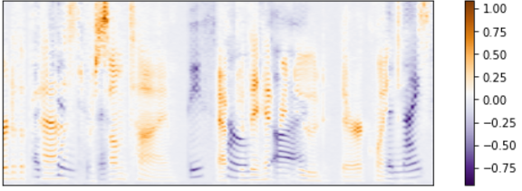

# Introducing source-contrastive estimation
## Learning deep embeddings for audio source separation


Have you ever been talking with someone in a room crowded with dozens of people talking at full volume and been amazed that you can still hear and understand your conversation partner? I sure haven’t — it’s part and parcel of being a human with at least average hearing ability. We are remarkably effective at navigating noisy environments, and understanding what we hear in them. For the most part, however, it doesn’t even seem remarkable to us.

Listen to an audio recording made in the same environment, however, and you will realize why speech and engineering researchers have been stumped by the “[cocktail party problem](https://en.wikipedia.org/wiki/Cocktail_party_effect)” ever since the early days of signal processing. If you don’t have your two ears (and whole body, which also conducts sound) in the scene, the reality of a noisy environment like a bar or loud party is one of an undifferentiated din of overlapping speech, reverberation, and interference of all sorts. Recordings made in such environments are often unusable in their original state:

> [Sample audio](singlemic.wav)

###### Source: [LibriSpeech](http://www.openslr.org/12/) Corpus

The field of source separation seeks to make signals like this usable by separating speakers onto separate tracks, recovering the original, much more intelligible, components of the mixture. Notice how the individual components of the mixture in Figure 1, on the right, have more orderly harmonics (the really narrow horizontal bands stacked on top of each other) and clearer structure in the vocal tract resonances (the thicker dark bands), compared to the mixture on the left:


###### Figure 1. Left, spectrogram of mixed audio. Right, individual components of the mixture. Audio credit: [LibriSpeech](http://www.openslr.org/12/) Corpus

In the past few years, deep learning has begun to be applied to audio source separation. Such work includes Huang et al.’s [RNN-based approach](https://arxiv.org/abs/1502.04149), [innovative cost functions](https://arxiv.org/abs/1607.00325) from Microsoft Research and Aalborg University, and a vector-embedding technique adopted by [deep clustering](https://arxiv.org/abs/1508.04306) and improved on in [deep attractor networks](https://arxiv.org/abs/1611.08930). These techniques have typically added a large improvement over linear matrix decomposition techniques, like non-negative matrix factorization. We plan to put up a blog post in the near future describing some of those approaches. Today, however, let’s dive into Lab41’s unique work in this space, an approach we call [source-contrastive estimation](https://arxiv.org/abs/1705.04662) (SCE).

## What is that man’s mask, anyway?
Like most deep learning-based approaches to source separation, our technique is a form of mask estimation. The spectrogram of a signal contains information about its relative power at different times and frequencies. When audio from two sources appears in a spectrogram, many of its components will be more strongly associated with one source than another, as Figure 2 illustrates below.



###### Figure 1. Left, spectrogram of mixed audio. Right, individual components of the mixture. Audio credit: [LibriSpeech](http://www.openslr.org/12/) Corpus

We can recover most of the signal from a source by just masking out the portions of the spectrogram that don’t belong to it. This can be done with a matrix, the same shape as the spectrogram itself, whose values are all between 0 and 1. Element-wise multiplication with the input spectrogram does what we need. Values of zero stop a component from coming through; values of one allow it to pass through unadulterated. Figure 3 below illustrates this process.


###### Figure 3. Top left, a mixture signal, made up of a target signal and an interferer. Top right, a mask image, made of zeroes (black) and ones, representing components where the target signal is stronger than the interferer. Bottom left, the result of masking the mixture signal by multiplying the magnitude spectrogram with the mask. Many of the interfering components from the interfering signal have been eliminated. Bottom right, the original target signal, for comparison. Audio credit: [LibriSpeech](http://www.openslr.org/12/) Corpus

## Networking event — costs and benefits

How do we get such a mask, you ask? One part of the answer is the network architecture and postprocessing that yields the given set of masks. The other part is the objective function that tells the model how to learn which masks work and which don’t.


###### Figure 4. Source-contrastive estimation network architecture. During inference, the output of the dense layer undergoes clustering (left branch); during training, it is passed to the source-contrastive loss function (SCE; right branch).

If We have two bidirectional [LSTM](http://colah.github.io/posts/2015-08-Understanding-LSTMs/) layers at the start, with the recurrence going over the time dimension of the spectrogram. Then a feedforward layer generates an embedding — a matrix with a 40-component vector assigned to each time-frequency bin. The code implementing this in TensorFlow is available on GitHub — here’s the juiciest bit, excerpted from a larger class definition:

```python
@tf_utils.scope_decorator
def network(self):
    """
    Construct the op for the network used in [1].  This consists of two
    BLSTM layers followed by a dense layer giving a set of T-F vectors of
    dimension embedding_size
    """

    # Get the shape of the input
    shape = tf.shape(self.X)

    # BLSTM layer one
    BLSTM_1 = tf_utils.BLSTM(self.X, self.layer_size, 'one',
                             nonlinearity=self.nonlinearity)
    # BLSTM layer two
    BLSTM_2 = tf_utils.BLSTM(BLSTM_1, self.layer_size, 'two',
                             nonlinearity=self.nonlinearity)
    # Feedforward layer
    feedforward = tf_utils.conv1d_layer(BLSTM_2,
                          [1, self.layer_size, self.embedding_size*self.F])
    # Reshape the feedforward output to have shape (T,F,K)
    embedding = tf.reshape(feedforward,
                         [shape[0], shape[1], self.F, self.embedding_size])

    return embedding
```

## What do you do with that?

The insight from deep clustering and deep attractor networks is that representing time-frequency bins in a dense vector space lets you nudge them around, so that components belonging to different speakers are easily separated. When you deploy the model on a mixture, it transforms the spectrogram into a space where the difference between speakers is pretty clear-cut, as Figure 5 shows.


###### Figure 5. Low-dimensional view of embedding for a two-speaker mixture

The vectors in this new space can be clustered using any old algorithm. We used K-means clustering. Cluster memberships can then be used to create masks by assigning 1s to all the time-frequency components in the cluster and -1 to all the other bins.

## Putting on training wheels

Getting the vectors in the embedding space to separate, however, is the tricky part, bringing us to the cost function at the heart of SCE. In deep attractor networks, the goal is to get each embedding close to a centroid of the speaker’s overall volume in the embedding space. In deep clustering, the story is less geometrically neat but the embeddings are optimized to approximate a bin-to-bin similarity matrix. We thought we could do even better.

The “source-contrastive” part of “source-contrastive estimation” makes a nod to [noise-contrastive estimation](http://proceedings.mlr.press/v9/gutmann10a/gutmann10a.pdf), the engine behind (some instantiations of) [word2vec](https://papers.nips.cc/paper/5021-distributed-representations-of-words-and-phrases-and-their-compositionality.pdf). The intuition is that an embedding can be optimized by simultaneously pushing it toward a target vector representing the speaker it belongs to and by pushing it away from other vectors, representing the other speakers in the mixture. This effects a contrast between bins that should be different and draws bins together when they share an identity. And although speaker identities are used during training, they are not needed during inference — neat!

Here’s another question: just where do we put the target vectors for the various speakers? We can actually just learn that along the way, too. As bin embeddings get pushed around and away from each other, so too will the speaker embeddings. As a side benefit, you should end up with similar-sounding speakers closer to each other in the embedding space and different-sounding ones further apart.

## And does it do anything?

Our experiments, documented in our [arXiv manuscript](https://arxiv.org/abs/1705.04662), indicate that SCE outperforms deep clustering in a number of settings, including mixtures of two women and of one man and one woman. This includes an improvement in signal-to-distortion ratio (SDR) of 1 or more dB when using SCE, compared to other techniques, as shown in Figure 6.


###### Figure 6. Source-to-distortion ratio for different separation techniques, across mixture conditions.

Another thing we think is really cool about our approach is that it cuts down on training time. Doing updates to a deep clustering model requires some hefty matrix computations (even after the impressive magic tricks its inventors pulled off to make their updates faster). Like its cousin noise-contrastive estimation, SCE presents a relatively lightweight means of estimating an embedding that separates speakers from each other. In our experiments, average wall clock time per minibatch in SCE was almost half that of deep clustering!

There is a lot more to do — right now, we are concerned that the margin between speakers in the embedding space is not wide enough, making it hard to separate ambiguous components. We also suspect that the information contained in our model could be put to work for other purposes — such as speaker identification or [diarization](https://en.wikipedia.org/wiki/Speaker_diarisation). We are also hard at work on ways to make the separation performance of SCE robust to noise, so that it can actually work in real-world scenarios. In any case, we are very encouraged by our results to date, even if it is a long way from solving the cocktail party problem in general. If you are intrigued, please read [our manuscript](https://arxiv.org/abs/1705.04662) and check out our [GitHub repo](https://github.com/lab41/magnolia)!


