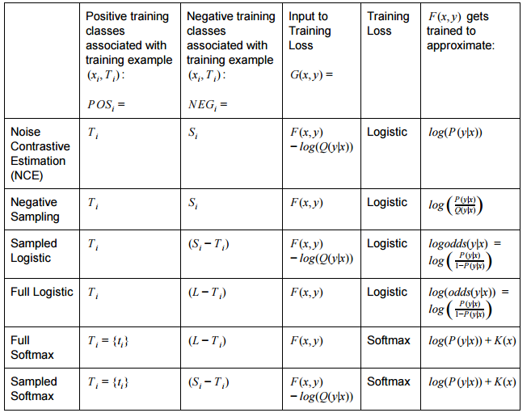
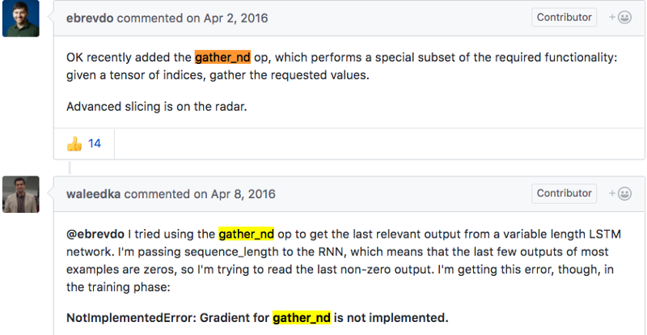
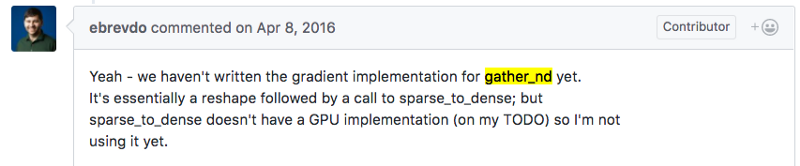
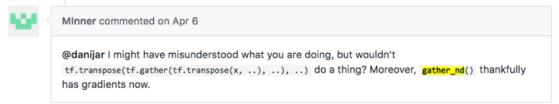

# New Sampling in Tensorflow
## Contrastive Estimation in Practice

At a recent MMCommons event, we had the opportunity to sit in on a panel with computer vision scientists on dealing with on unstructured data. After giving a demonstration from our submitted work on open source image classification, it came as no surprise that the majority of the speakers piped up at length about how sampling methods have come to their aid. These amounted to various cases when the label space is too large or there wasn’t enough data. 

Separately and on the totally different domain of speaker separation, we reached the same conclusions when we implemented our very own source-contrastive estimation (SCE) algorithm, documented in another post by my colleague. We admit that it is a shamelessly gimmicky name (shh, don’t tell reviewers) for an enhancement on noise-contrastive estimation. But the idea remains the same: where you’re separating distributions from each other, i.e. contrastive estimation, sampling methods can be your ally.


---

How exactly does sampling help? Regarding sampling in the TensorFlow documentation, the phrase that you’re searching for (and the whole point of this post) is candidate sampling. The idea comes about when training a single example: we don’t want to go through the costly operation of evaluating every possible class, a big downer when you have a ton of labels. What you can do instead is build a function that only uses a small subset of your labels (i.e., sampling your universe of labels) to approximate the original “exhaustive” loss function, which may take the form of, say, the full softmax function.

The technique is fairly powerful and the idea is proven out from word2vec embeddings to Restricted Boltzmann Machines. But how do you actually do it? What are the relevant TensorFlow calls? Turns out there are some easy solutions that you may not have known about that could save hours of effort. In this post, we’ll take you through the algorithms and tools we’ve experimented with, some of which have made their way into our code and publications. If we’re instructive, then by the end of this article, you should be able to optimize for a sampled version of your novel cost function, or any arbitrary cost function for that matter, one using TensorFlow. 


---

### A Little History

The current libraries are documented with a lot of goodies that include cost functions on top of sampling distributions. For example, noise contrastive estimation is available:

```
tf.nn.nce_loss(weights, biases, inputs, labels, num_sampled, 
               num_classes, num_true=1, sampled_values=None,
               remove_accidental_hits=False, partition_strategy=
               'mod', name='nce_loss')
```

It wasn’t always the case that these guys were there for you though, and it surprises me how recently they’ve been added.  For example, stuff in `candidate_sampling_ops.py` has the last git pull just last month, and the documentation was uploaded in Dec 2015.  Back in the day, word2vec and most of the other label sampling methods didn’t have GPU support. In fact, look at the example on line 148 in TF 1.1; it still reads:

```
# Ops and variables pinned to the CPU because of missing GPU implementation 
with tf.device('/cpu:0'):
```

The lack of implementations of large layers was primarily a function of the fact that in cases where you would even need to sample the labels, the size of the weight matrices is proportional to an extraordinary amount of unique labels (e.g., in the YFCC corpus, it’s 400k words after it’s been pruned from six million words.) Memory on poor researcher GPUs had a hard time keeping up a few years ago.


We experienced much the same, looking on in jealousy at the contributions from Google and Facebook. But then it happened…we finally got our Titan X cards. We got six of them, in fact, and then we were tickled to death. 
With this huge hammer, we looked around for the biggest nail. So late last year, we downloaded the biggest dataset we could get our hands on (100 million images) with the most amount of metadata (14GB), and threw the largest neural network we could at it. The trouble was, while we could find ways to fully use the 16GB of memory, the actual matrix-vector operation still took way too long. Enter candidate sampling, and why we’re here today.

### Canned Functions for Your First Pass

Again, a lot of the functions are semi-new. The TensorFlow community has been rushing to accommodate with generous contributions to the official repository. Specifically for candidate sampling, we’ve got all sorts of capabilities from `sampled_softmax` (this one’s an oldie), `nce_loss`, `tf.nn.uniform_candidate_sampler`, and all of their variants. You can see what all of these guys mean from the documentation, nicely summarized in:



Logs and odds, oh my! All you really need to know is that the *positive* and *negative* samples (second and third columns) relate to the match or mismatch between the label and the data. The remainder of the table just tells you how to use those samples.

This is all great if what you’re trying to do falls into any one of these categories. The thing is, you might want to do something different, and sometimes cost functions don’t really fit into any of the above forms. Secondly, if you want to sample from a specific distribution, you’re beholden to the available ones in TensorFlow, which only include the *Zipfian* distribution, the boring and ever-present uniform distribution, and an empirical distribution (think histogram) based on a record of your past true samples. Things might have changed as of this writing, but that’s hardly a complete set of distributions.

### Messin' with Vectors

So…what if you want to do all that stuff yourself? What if you had no choice but to do the sampling manually because you needed to manipulate the vectors (embeddings) in some special way that doesn’t happen to be in that table above…and you wanted to do it *on the GPU*? In other words, we’d like to know how to sample off-GPU and then do math-stuffs on-GPU.

We found the most amount of flexibility in the function `gather_nd`, and implementing dot products ourselves.

#### A Little Drama

I’ll get to the explanation of what `gather_nd` does (and why you should use it) a little later, but first an odyssey of big data proportions. TensorFlow default installation (as of this writing) when you type in pip install `--upgrade tensorflow-gpu` is an older version 1.0. This little fun fact provided us with hours of ever-so-fun entertainment, which we didn’t know awaited us when implementing with `gather_nd`. It looked like we were going to make the SIPS and NIPS 2017 deadline, and then, que disastre! Irrecoverable errors nuked our graphs. Scouring the forums for an explanation, we almost lost our minds when we read this.




The nonchalant, “Yeah — we haven’t written the gradient implementation for gather_nd yet,” was enough to make our hearts skip a beat. What followed in the thread was a bunch of, “when will it get implemented?” and, “is it done yet?” The thread was so long, we left for home before reaching the end. Had we scrolled far enough, we would have seen this:



This comment is April 6, 2017, but the implementation finished a few months before that. Whew, it’s a simple fix: you will need to get at least version 1.1, which you can do directly from the TensorFlow Github page. (They do nightly builds.)


